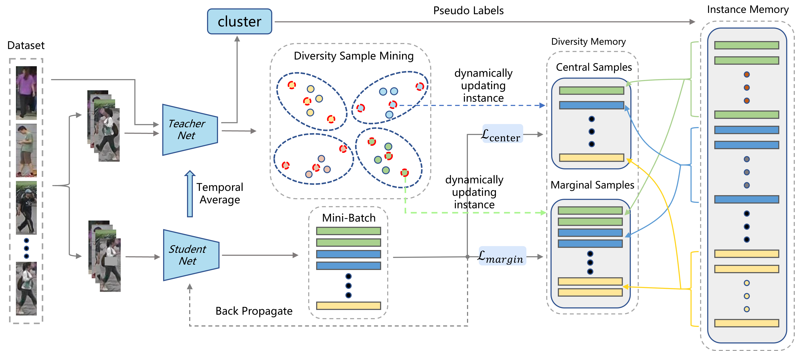

# Cluster-aware Diversity Samples Mining for Unsupervised Person Re-Identification


This repository is the official implementation of our paper "[Cluster-aware Diversity Samples Mining for Unsupervised Person Re-Identification](https://ieeexplore.ieee.org/document/9945479)".  



## Requirements

---

    git clone https://github.com/colinzhaoxp/CDSM.git
    cd CDSM
    pip install -r requirements.txt
    python setup.py develop

## Prepare Datasets

---

Download the datasets Market-1501,MSMT17,DukeMTMC-reID from this [link](https://drive.google.com/file/d/19oWiYGjTgouFMK_psZvH8ysDGQ1KUbk-/view?usp=sharing) and unzip them under the directory like:

    CDSM/examples/data
    ├── market1501
    │   └── Market-1501-v15.09.15
    ├── dukemtmcreid
    │   └── DukeMTMC-reID
    └── msmt17
        └── MSMT17_V1

## Training

---

Examples:

Market-1501:

    python examples/train.py -b 128 -a resnet50 -d market1501 --k1 25 --iters 400 --eps 0.45 --momentum 0.05 --num-instances 8 --mem-instances 4 --hard-weight 0.5 --pooling-type gem --memorybank CMhybird_v5 --epochs 50 --logs-dir examples/logs/market1501/resnet50_gem_cmhybird
    


DukeMTMC-reID:

    python examples/train.py -b 256 -a resnet50 -d dukemtmcreid --k1 30 --iters 400 --eps 0.6 --momentum 0.05 --num-instances 8 --mem-instances 4 --hard-weight 0.5 --pooling-type gem --memorybank CMhybird_v5 --epochs 50 --logs-dir examples/logs/dukemtmcreid/resnet50_gem_cmhybird

MSMT17:

    python examples/train.py -b 256 -a resnet50 -d msmt17 --k1 30 --iters 400 --eps 0.6 --momentum 0.05 --num-instances 8 --mem-instances 4 --hard-weight 0.5 --pooling-type gem --memorybank CMhybird_v5 --epochs 50 --logs-dir examples/logs/msmt17/resnet50_gem_cmhybird

- use `-a resnet50` (default) for the backbone of ResNet-50;
- use `--pooling-type gem` for Generalized Mean Pooling (GEM) pooling and `--smooth` for label smoothing. 

## Evaluation

---

To evaluate my model on ImageNet, run:

    python examples/test.py -d $DATASET --resume $PATH --pooling-type gem

## Results

---

Our model achieves the following performance on :

| Dataset            | Market1501 |      |      |      | DukeMTMC-reID |      |      |      | MSMT17 |      |       |       |
| ------------------ |------------|------|------| ---- |---------------| ---- | ---- |------|---------------| ---- |-------|-------|
| Setting            | mAP        | R1   | R5   | R10  | mAP           | R1   | R5   | R10  |mAP        | R1    | R5    | R10   |
| Fully Unsupervised | 85.6       | 93.9 | 97.8 | 98.5 | 73.7          | 85.1 | 92.4 | 94.7 |31.0  | 61.1 | 71.3  | 76.2  |


## Citation

---

If you find this code useful for your research, please cite our paper

```
@inproceedings{zhao2022cdsm,  
    title={Cluster-aware Diversity Samples Mining for Unsupervised Person Re-Identification},
    author={Zhao, Xinpeng and Dou, Xiao and Zhang, Xiaowei},  
    booktitle={2022 IEEE International Conference on Systems, Man, and Cybernetics (SMC)},
    year={2022},
    pages={1707-1712},  
    doi={10.1109/SMC53654.2022.9945479}
}
```

## Acknowledgements

---

This project is not possible without multiple great opensourced codebases. We list them below.

- [SpCL](https://github.com/yxgeee/SpCL)
- [HHCL](https://github.com/bupt-ai-cz/HHCL-ReID)